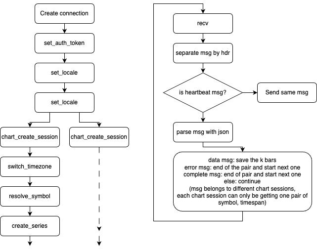

# TradingView Scraper
## Execution

#### Development
```bash
MODE=dev python main_tradingview.py
```

#### Production
```bash
MODE=prod python main_tradingview.py
```

## Environment Variables
* variables
    `MODE` - `dev` or `prod`
* dotenv files
    * production
        * `.env.local.production`
        * `.env.production`
        * `.env.local`
        * `.env`
    * development
        * `.env.local.development`
        * `.env.development`
        * `.env.local`
        * `.env`
    * required variables
        * DBNAME: name of the database
        * DBUSER: username of the database
        * DBHOST: host of the database
        * DBPORT: port of the database
        * DBPASS: password of the database
        * TV_STORAGE_DIR: directory to store the tradingview data
        * TV_MAX_CS: maximum number of concurrent chart sessions for tradingview
    * optional
        * TV_USERNAME: usernames for tradingview basic accounts, split by comma
        * TV_PASSWORD: passwords for tradingview basic accounts, split by comma
        * PRO_TV_USERNAME: usernames for tradingview pro accounts, split by comma
        * PRO_TV_PASSWORD: passwords for tradingview pro accounts, split by comma


## Structure

* main_tradingview.py
    * Starts a new scraper engine for each account in a different process
* packages
    * tradingview
        * scraper
            * auth.py
                * login tradingview and get the auth token
                * caches auth data and refreshes each three days
            * engine.py
                * schedules tasks and executes the tasks
                * uses task_scheduler.py and symbol_pair_scheduler.py
                * tasks
                    * task_load_symbol
                        * loads symbol data from database, 10000 symbols at a time
                        * generate symbol pairs
                        * decide to wait or ready the symbol pair by reading the last timestamp of the chart
                        * uses load.py
                    * task_get_bars
                        * get bars of symbol pairs that are in ready list of scheduler
                        * 1000 pairs at a time
                        * uses scraper.py
                    * task_update_logger
                        * run once a day
                        * creates new file log handler
                    * task_update_auth
                        * run once an hour
                        * calls auth.py to refresh auth data, relogin if needed
            * load.py
                * loads symbol data from local postgres database
            * scraper.py
                * scrapes data from tradingview websocket
            * symbol_pair_scheduler.py
                * ready list
                    * symbol pairs that are ready to be scraped
                * waiting list
                    * symbol pairs that are waiting to be scraped
                    * maintained using heapq
                    * check to pop from waiting list everytime getting ready pairs
            * task_scheduler.py
                * schedules tasks
            * write.py
                * writes bars to file storage
                * binary search on lines to find the overlapped bars of new and old data
                * compares the overlapped and writes the result in other files
                * overwrite the old bars with new bars

### Scraper Flow
